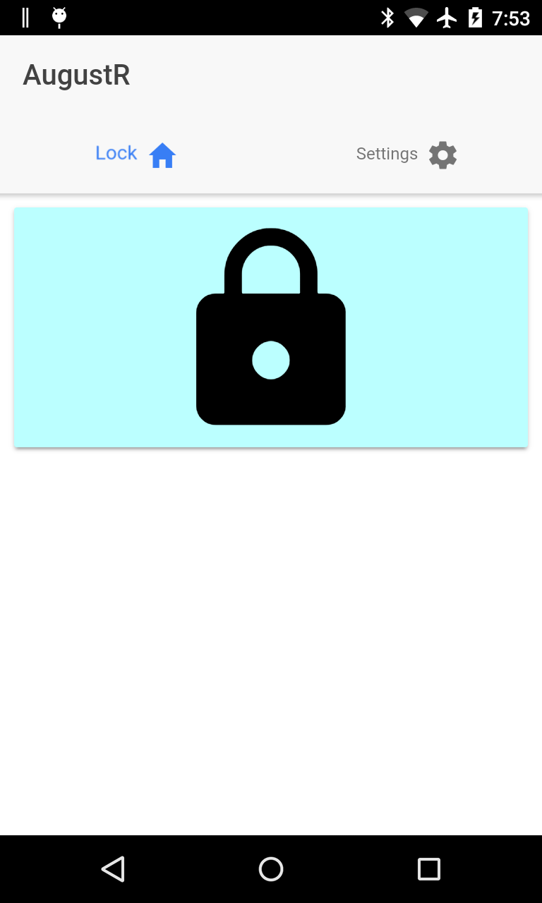
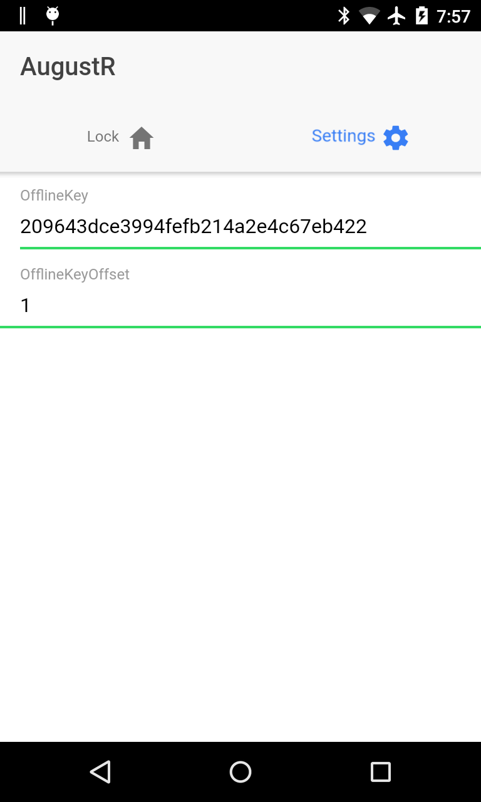

# AugustR
The [August Smart Lock](http://august.com) is a decent smart lock other than not having an open, accessible API. In fact, without one it's actually kind of a dumb lock, not a smart one. Let's fix that.

This project uses an old/spare phone to create an open Web API for the August Smart Lock. Feel free to use it as is or rip out any of the components to use in your own project:
1. An [August Bluetooth Library](ionic-app/src/components/augustlockservice.ts) implementing the offline key protocol (ported to Typescript from a fork of the [AugustCtl](https://github.com/sretlawd/augustctl) project)
1. Ionic 2 app with background notification processing of Firebase Cloud Messaging (FCM) Notifications, using the library to interact with th elock
1. Simple Azure Function Web API to trigger the FCM Notification on demand.

## Prerequisites

Android instructions listed, should theoretically work if you build it for iOS but I didn't do any testing of that.
* Android SDK
    * Extras: Google Play services
    * Extras: Google Repository
* Ionic 2 (incl. Cordova)
* Firebase Account & Project (for push notifications)
* Microsoft Azure account (for web API)
* A rooted Android phone with the August app installed
* A phone (with BLE) to leave near the August Smart Lock to power the API

## Build instructions

Firebase Console:

1. Create a new project (ex: "august-repeater")
1. Under Settings > Cloud Messaging, take note of the project's "server key"
1. Under Overview > Add app (Android)
    1. Pick a package name (ex: "us.m4rc.augustR")
    1. Download the config file (google-services.json)

Azure Console

1. Create a new Function App
1. Create a function from the HttpTrigger-CSharp template w/ "Function" authorization level
1. Paste in the code from [azure-function/run.csx](azure-function/run.csx), and enter your Firebase project's server key into the `FIREBASE_SERVER_KEY` variable.
1. Make a note of the Function Url. This is your Web API.

Get Offline Keys from a logged-in August app

1. With a _rooted_ Android phone, get the `handshakeKey` and `handshakeKeyIndex` from the `/data/data/com.august.luna/shared_prefs/PeripheralInfoCache.xml` file, or
1. From an iPhone, the key and offset can be found in the plist file: `User Applications/August/Library/Preferences/com.august.iossapp.plist`

Ionic App:

1. Edit the config.xml and ionic.config.json to use your package name
1. Add the google-services.json from the Firebase Console to the ionic-app directory
1. Build and deploy the app to a test device attached to your computer: `ionic run android --device`
1. In the running app, go to the settings tab and enter in the key and index retrieved from the August app.
1. Test that the offline key works by unlocking the door with the lock button on the app Lock tab

## Using the API and next steps:

The app and the function are set up, and the phone is plugged in to a charger and placed in bluetooth range of the August Smart Lock. You should then be able to access the API by pasting the Azure Function Url into your web browser (or using the "Run" button in the Azure Portal). What happens when you do that?
* The Azure Function calls the Firebase Cloud Messaging service to send a notification to all instances of your app
* On the phone, the app running in the background is triggered by the notification.
* The app uses bluetooth to communicate with the lock and use the offline key to send the "unlock" command to the lock

### Next steps (left as an exercise to the reader):
* Implement the other commands (lock, status) in the app and Web API function (I only use "unlock" since I have "Auto-Lock" turned on for my August Smart Lock)
* Pull out the `augustlockservice.ts` into a reusable cordova plugin
* See if the code works for iOS

### Questions:
Q: Why is this necessary?  
A: August doesn't provide an open, accessible API

Q: Why not?  
A: I don't know, it does seem pretty jerky. Who knows?

Q: What's the latency like?  
A: It seems to take between 5-15 seconds, depending on network latency and whether the phone has a good bluetooth signal to the lock.

Q: What do you use the API for?  
A: I wrote an app called [Zones](https://play.google.com/store/apps/details?id=us.m4rc.zones) which lets me easily trigger Web APIs on my Android Wear watch. Now I can open my August Smart Lock door from my Android Wear watch.

Q: Why'd you write _that_ app?  
A: August also doesn't have a way to unlock your door from Android Wear. Like I said, they are jerks.

## License (MIT)
------
Copyright (c) 2017 Marcus Lum

Permission is hereby granted, free of charge, to any person obtaining a copy of this software and associated documentation files (the "Software"), to deal in the Software without restriction, including without limitation the rights to use, copy, modify, merge, publish, distribute, sublicense, and/or sell copies of the Software, and to permit persons to whom the Software is furnished to do so, subject to the following conditions:

The above copyright notice and this permission notice shall be included in all copies or substantial portions of the Software.

THE SOFTWARE IS PROVIDED "AS IS", WITHOUT WARRANTY OF ANY KIND, EXPRESS OR IMPLIED, INCLUDING BUT NOT LIMITED TO THE WARRANTIES OF MERCHANTABILITY, FITNESS FOR A PARTICULAR PURPOSE AND NONINFRINGEMENT. IN NO EVENT SHALL THE AUTHORS OR COPYRIGHT HOLDERS BE LIABLE FOR ANY CLAIM, DAMAGES OR OTHER LIABILITY, WHETHER IN AN ACTION OF CONTRACT, TORT OR OTHERWISE, ARISING FROM, OUT OF OR IN CONNECTION WITH THE SOFTWARE OR THE USE OR OTHER DEALINGS IN THE SOFTWARE.
